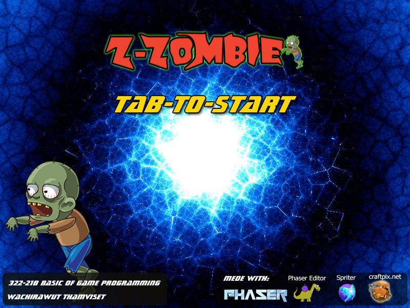
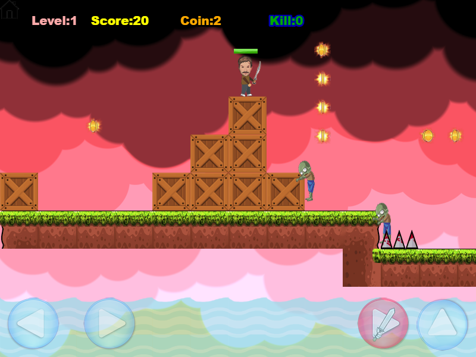
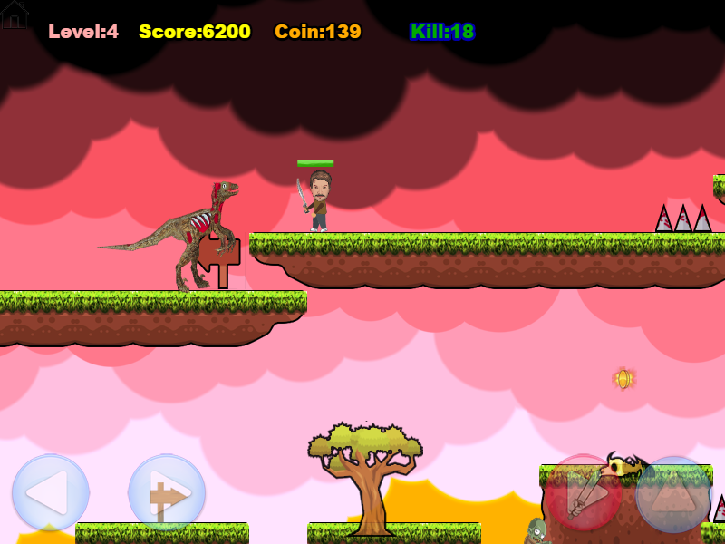

# zzombie phaser

ZZombie is a side-scrolling action platform game that is made with [Phaser](http://phaser.io/).  
This game was created for education purpose in [Basic of Game Programming](http://webclass.devtrainer.net/webclass/learn-home/322218) classroom at Khon Kaen University.

* Play on Web Browser at http://zombie.devtrainer.net
* Play on Android at https://play.google.com/store/apps/details?id=phaser.game.twachi.zzombie
* Play on Chrome OS at https://chrome.google.com/webstore/detail/zzombie/aeoglaffenaokmaamcendeiagkdnadfn
* Play on iOS at ... coming soon ... 

### Game Play
* To Walk, press the arrow keys left or right.
* To Jump, press the arrow key up.
* To Attack, press the key "X".

### Screen Shots
  
  
 
 
### Tools
The list of tools are used in this project.

* [Phaser](https://github.com/photonstorm/phaser) the core game SDK.
* [Phaser Editor](http://phasereditor.boniatillo.com/) A friendly IDE for HTML5 games programming.
* [Tiled](http://www.mapeditor.org/) A Tiled Map Editor
* [Spriter](https://brashmonkey.com/) 2D sprite animation character creation software.
* [Audacity](http://www.audacityteam.org/) Audacity is free, open source, audio software for multi-track recording and editing.

### Game Assets and Arts

* [Zombies from CraftPix.net] (https://craftpix.net/freebies/)
* [Tileset from GameArt2D.com] (http://www.gameart2d.com/freebies.html) 
* [Shader: Cloud] http://glslsandbox.com/e#35192.0
* [Shader: Background] http://glslsandbox.com/e#34739.30

### About

Wachirawut Thamviset, Ph.D 

Department of Computer Science,
Faculty of Science, Khon Kaen University, Thailand.
